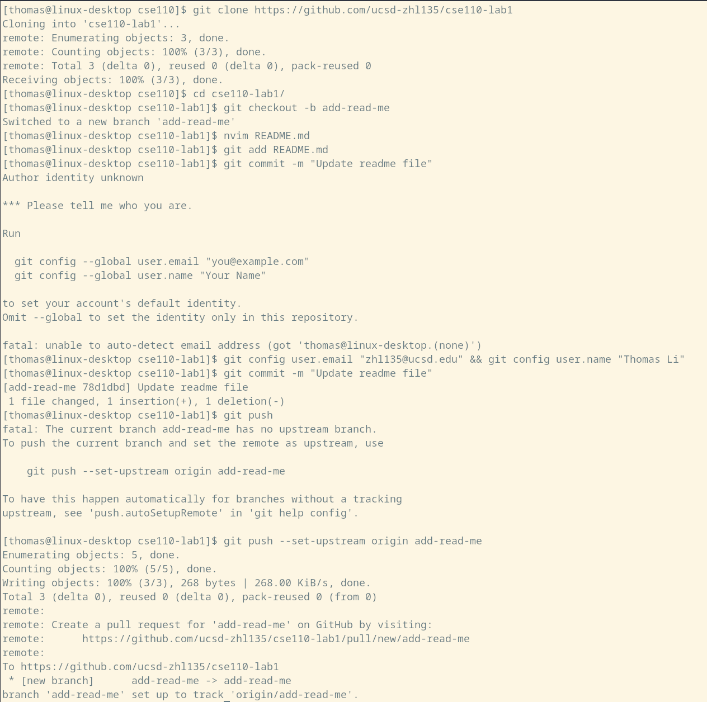

# Thomas's User Page

I'm **Thomas Li**, a second year CS major at *UCSD*. I'm interested in competitive programming and writing performant code. I'm also interested in hacking and reverse engineering.

> This is a quote - Thomas Li

Here's my code for [easyquery](https://open.kattis.com/problems/easyquery) (yes my solution is overcomplicated):

```cpp
#include <bits/stdc++.h>
using namespace std; 
typedef long long ll;
//#define int ll
#define rep(i, a, b) for(int i = a; i < (b); ++i)
#define all(x) begin(x), end(x)
#define sz(x) (int)(x).size()
#define PB push_back
#define FS first
#define SD second
#define ary(k) array<int,k>
template<class A,class B> void cmx(A& x, B y) {x=max<A>(x,y);}
template<class A,class B> void cmn(A& x, B y) {x=min<A>(x,y);}
typedef pair<int, int> pii;
typedef vector<int> vi;

namespace std {

template<class Fun>
class y_combinator_result {
    Fun fun_;
public:
    template<class T>
    explicit y_combinator_result(T &&fun): fun_(std::forward<T>(fun)) {}

    template<class ...Args>
    decltype(auto) operator()(Args &&...args) {
        return fun_(std::ref(*this), std::forward<Args>(args)...);
    }
};

template<class Fun>
decltype(auto) yc(Fun &&fun) {
    return y_combinator_result<std::decay_t<Fun>>(std::forward<Fun>(fun));
}

} // namespace std
const int LG = 30,C = 3,MX = 1e9;
struct Node{
    int l,r; 
    vi cnt;
    vector<ary(LG)> changes;
    Node() : l{-1},r{-1} {}
};
void solve(){
    vector<Node> seg;
    int n,q; cin >> n >> q;
    vi a(n);
    vector<ll> ans(q); for(int& v : a) cin >> v; 
    auto b = a; sort(all(b)); b.erase(unique(all(b)),b.end());
    rep(i,0,n){
        a[i] = lower_bound(all(b),a[i])-b.begin();
    } 
    vector<ary(4)> qu; 
    rep(i,0,q){
        int l,r,u,v; cin >> l >> r >> u >> v;
        l--; r--; u--; v--;
        qu.PB({l,r,u,v});
    }
    auto build = yc([&](auto&& self, int lv, int rv, vi& vec, int c)->int{
        if(!sz(vec)) return -1;
        //cerr << lv << " " << rv << "\n";
        int u = sz(seg); seg.PB({}); 
        int mid = (lv+rv)/2,m = sz(vec);
        vi lft,rit;
        for(int x : vec){
            if(x <= mid) lft.PB(x);
            else rit.PB(x);
        }
        if(lv != rv){
            seg[u].l = self(lv,mid,lft,c);
            seg[u].r = self(mid+1,rv,rit,c);
        }

        seg[u].cnt.assign(m,0);
        seg[u].changes.assign(m,{});
        rep(i,0,m){
            if(i) seg[u].cnt[i] = seg[u].cnt[i-1];
            seg[u].cnt[i] += vec[i] > mid;
        }
        unordered_map<int,deque<int>> occ; 
        ary(LG) bst;
        rep(j,0,LG) bst[j] = -1;
        rep(i,0,m){
            auto& oc = occ[vec[i]];
            oc.PB(i);
            while(sz(oc) > C) oc.pop_front();
            if(sz(oc) > c) rep(k,0,LG) if(b[vec[i]] >> k & 1){
                cmx(bst[k],oc[sz(oc)-c-1]);
            } 
            seg[u].changes[i] = bst;
        }
        return u;
    });
    int curc = -1;
    auto query = yc([&](auto&& self, int u, int lv, int rv, int x, int y, int l, int r)->int{
        //cerr << u << " " << x << " " << y << " " << l << " " << r << "\n";
        if(u == -1) return {};
        if(l > r) return {};
        if(lv == rv){
            int ulen = y-x+1;
            int llen = r-l+1;
            assert(ulen <= llen);
            assert(curc != -1);
            if(ulen > curc) return b[lv];
            return 0;
        }
        int len = r-l+1;
        if(x == 0 && y == len-1){
            int cur = 0;
            auto& ch = seg[u].changes[r];
            rep(i,0,LG){
                if(ch[i] >= l){
                    cur |= 1<<i; 
                }
            }
            return cur;
        }
        auto num_left = [&](int i){
            if(i < 0) return 0;
            return i+1-seg[u].cnt[i];
        };
        int mid = (lv+rv)/2;
        int lft_l = (l == 0 ? 0 : l-seg[u].cnt[l-1]);
        int lft_r = num_left(r)-1;
        int rit_l = (l == 0 ? 0 : seg[u].cnt[l-1]);
        int rit_r = seg[u].cnt[r]-1;
        
        int lft_len = lft_r-lft_l+1;

        //cerr << "nws " << lft_l << " " << lft_r << " " << rit_l << " " << rit_r << "\n";
        if(y < lft_len){
            return self(seg[u].l,lv,mid,x,y,lft_l,lft_r);
        } else if(x >= lft_len){
            return self(seg[u].r,mid+1,rv,x-lft_len,y-lft_len,rit_l,rit_r);
        } else{
            auto lft = self(seg[u].l,lv,mid,x,lft_len-1,lft_l,lft_r);
            auto rit = self(seg[u].r,mid+1,rv,0,y-lft_len,rit_l,rit_r);
            return lft|rit;
        }
    });
    rep(c,0,C){
        curc = c;
        seg.clear();
        int rt = build(0,sz(b)-1,a,c);
        //cerr << double(ed-st)/CLOCKS_PER_SEC << "\n";
        rep(i,0,q){
            auto[l,r,u,v] = qu[i];
            //cerr << "kths " << u << " " << v << " " << l << " " << r << "\n";
            ans[i] += query(rt,0,sz(b)-1,u,v,l,r);
        } 
    }
    rep(i,0,q){
        cout << ans[i] << "\n";
    }
}
signed main() {
    cin.tie(0)->sync_with_stdio(0); cin.exceptions(cin.failbit);
    int t; cin >> t; while(t--) solve();
}
```
Section link
[Go back up](#thomass-user-page)

Relative link
[README.md](README.md)

Here are the screenshots for the lab:




Task list:
- [x] Be grey skill
- [ ] Solve 1949E

I don't know
- Network simplex
- Top tree

Top ten data structures
1. bitset
2. bitset
3. bitset

